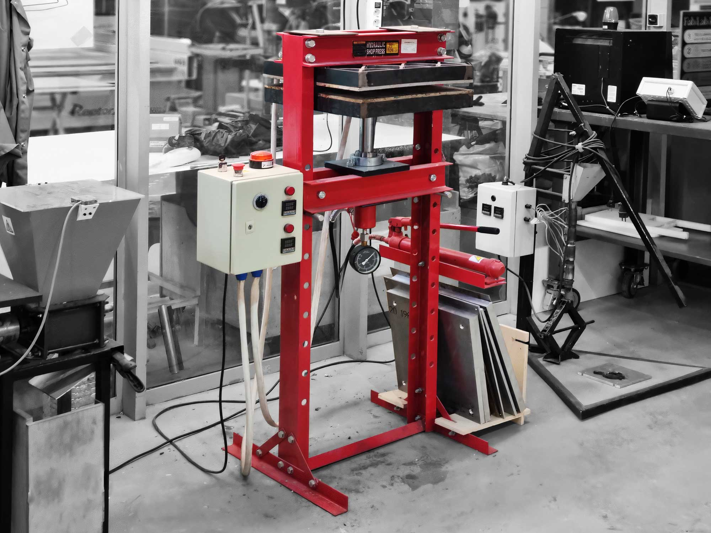
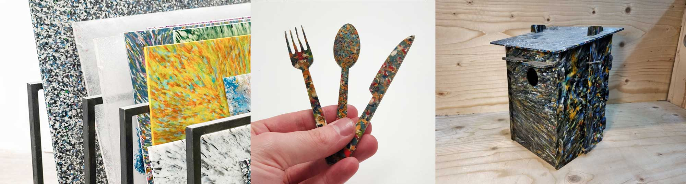
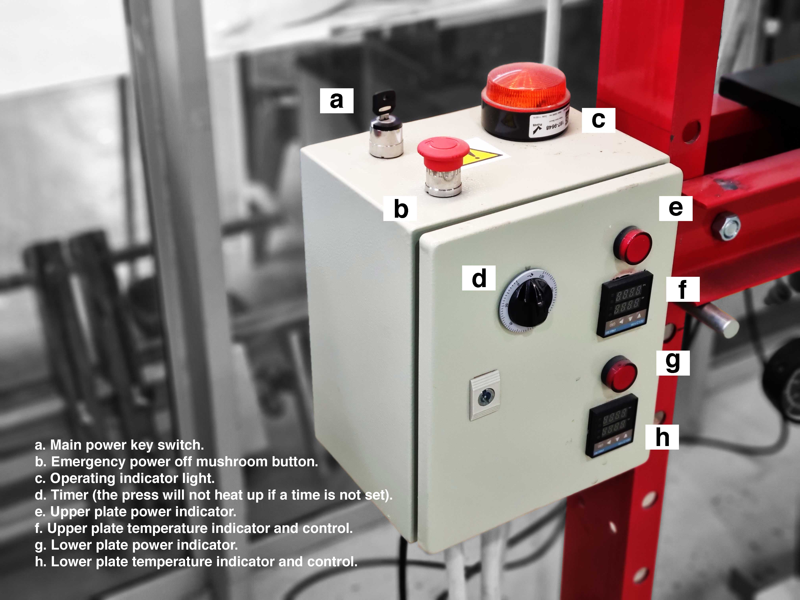

# Precious Plastic Sheetpress

## Technical specifications

- **Brand:** Fab Lab Barcelona (concept by Precious Plastic)
- **Work area:** Laser cutting room 
- **Materials:** Thermoplastics (PLA, HDPE, LDPE, PET, PP, PS...), biomaterials, other
- **Technology:** Heating, pressing, moulding
- **Machine parts:**  ///MACHINE PARTS DIAGRAM///  

## Applications

  - Creating sheets (from 3mm to 15mm thick) with thermoplastics. The size of the sheet depends on the frame used.
  - Using the pressure to compress a material.
  - Using the heated platforms to melt a material.

Precious Plastic sheet examples | PLA cuttlery by Dídac Torrent [(@torrent.fab)](https://www.instagram.com/torrent.fab/) | Birdhouse by Adai Suriñach (unknown design)  

## Health & Safety

<ins>CAUTION: This machine is highly exposed to the user. The platforms can reach very hot temperatures (over 300°C), so it is important to be well protected and to follow the operating instructions.</ins>  

**Safety information:**
  - Be always aware of the temperature of both platforms.
  - Use <ins>welding gloves</ins> to manipulate anything between the two platforms of the press when the heat is ON.
  - Some thermoplastics expel toxic fumes when melted. Use <ins>safety goggles</ins> and <ins>mask</ins> if needed.
  - Be careful with long hair and other stuff that can get caught by the press.
  - Don't use more pressure than what is needed. This could damage the machine.
  - Don't use earphones. Being able to hear and smell is fundamental when using Precious Plastic machines.
  - Safety button just turns off the machine, but platforms take long to cool down.
  - IF YOU HAVE ANY DOUBT, ASK! :)  

## Operation

**CONTROL BOX**

**OPERATION PROCEDURE**

**1.** Plug in the Sheetpress, check that the emergency stop **(b)** is released and switch on the main power switch **(a)**.  
**2.** Check the required temperature to melt your type of plastic and set the plate temperature controllers **(f+h)** to this temperature.  
**3.** Set a time of the timer **(d)**, this can be the specific time reuired for the process or an arbitrary amount. <ins>The press will not begin to heat if a time is not set.</ins>  
**4.** Close the pressing plates using the bottle jack and wait for them to heat up.  
**5.** When the Sheetpress is at the desired temperature, open the pressing plates of the Sheetpress by releasing pressure from the bottle jack.  
**6.** Place the bottom aluminium sheet on the bottom platform and apply a layer of silicone oil or suitbale lubricant. Make sure to remove any remnants of the previous sheet.  
**7.** Place the mould frame on the bottom aluminium sheet.  
**8.** Load the plastic into the mould.  
**9.** Spread the plastic evenly across the area inside the mould frame. It's recommended to put slightly less material around a 100mm border offset on the inside of the edges.  
**10.** Oil the other part of the mould (that comes inside of the frame) and place the oiled side facing down on top of the spread plastic.  
**11.** Close the pressing plates using the bottle jack until the pressure gauge reads the desired pressure. <ins>Do not exceed 5 tons.</ins>  
**12.** Keep monitoring the pressure. Plastic reduces its size when it melts.  
**13.** When the mould has been in the Sheetpress for the required melting time, switch off the Sheetpress and allow to cool in situ.  
**14.** Alternatively you can take out the mould and allow the sheet to cool externally.  
**15.** Once everything has cooled down, clean the aluminium sheet and mould and make sure the machine is ready to use.  

You can see an example of the procedure here: [Making a PLA sheet at Fab Lab Barcelona by Dídac Torrent](https://www.instagram.com/reel/CiSu4QyAFjV/)  

**TROUBLESHOOTING**

- **Plates are not heating:** Timer **(d)** not set. | Power indicators **(e+g)** not illuminated. | Emergency power off mushroom button **(c.)** engaged.
- **Press is creating fumes or smoke:** Check that the temperatures are set correctly for the material being used. | Check no plastic material is in direct contact with heated plates.

**USEFUL INFORMATION AND TIPS**

- Don't retract the plate further than you need as the jack moves in very small increments and it takes a long time to raise the plate.

## Materials settings
These are some of the settings tested for the different thermoplastics to create sheets of different thicknesses.  

## Maintenance
Borrowed from Precious Plastic: [Sheetpress Maintenance by Precious Plastic](https://onearmy.github.io/academy/build/sheetpressrun#-maintain)

**WEEKLY**  
- **Clean the heating plates:** Scrape any remiant material from the heating plates. You may need to use a high volume alcohol if there is heavy corrosion.  
- **Grease rails:** Use a wooden spatula to apply a liberal amount of grease to all the rails.  

**MONTHLY**  
- **Inspect and replace mould sheets:** Inspect your mould sheets, if any of them are damaged beyond repair then they may need replacing.  
- **Check website for hacks/updates:** The community are continuously developing hacks, modifications and techniques which get shared on the internet, take a look to see what is there that can help or inspire you!  

**YEARLY**  
- **Deep clean heating plates:** Scrape any remiant material from the heating plates. You may need to use a high volume alcohol if there is heavy corrosion. You may also need to use a rotary sander to remove tough burnt on material but be gentle, use a high grit sandpaper (>220) to preserve the flatness of the sheet.  
- **Check oil in jacks:** Bleed and replace the oil in the jacks.  
- **Check electronics:** Check the resistance of your elements on each of the three phases is equal to the number of heating elements attached to each phase. If it does not one of your heating elements may be broken, use a thermal camera to check. Check all the components inside the enclosure for visual signs of melting/burning and replace anything that appears damaged. Re paint worn areas Check the body panels and frame for signs of ware, repaint any exposed metal to protect it from corrosion.    

## External resources

  - [Suppliers](https://community.preciousplastic.com/academy/build/sheetpress)
  - [User Manual](https://community.preciousplastic.com/academy/build/sheetpressrun)
  - [Info page](https://community.preciousplastic.com/academy/build/sheetpress)
