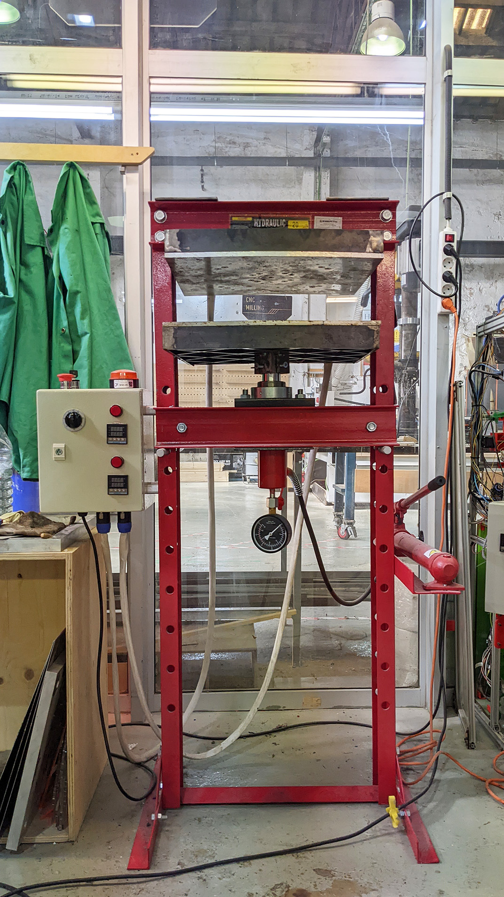
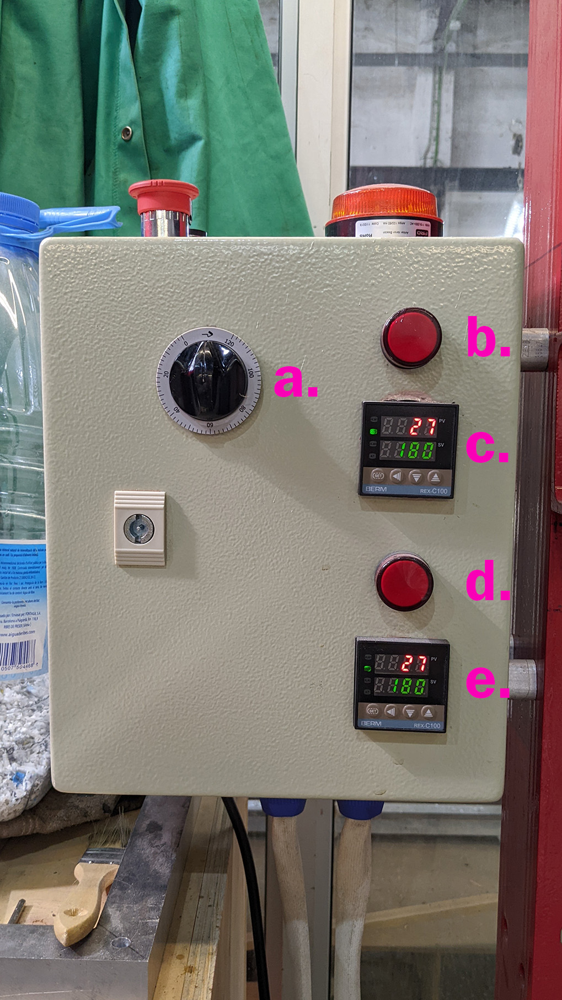
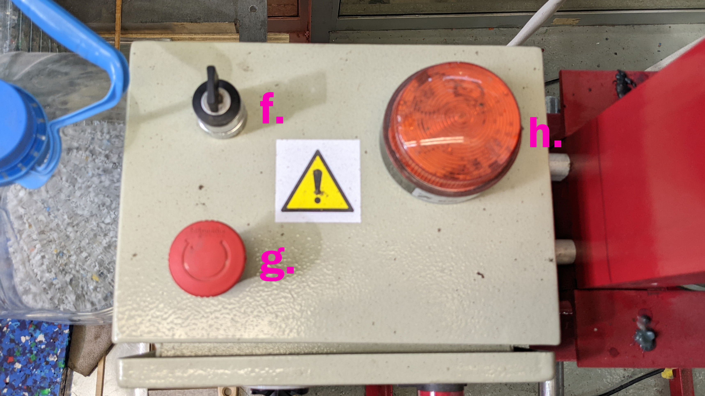

## Technical specifications

- **Brand: Precious Plastic / Fab Lab Barcelona** 
- **Work area: Fab Lab** 
- **Materials: Plastics**
- **Technology: Heating, Pressing, Moulding**

## Applications

  - List of applications
  - melting and squashing plastic

## Health & Safety

- Hot - wear gloves

## Opperation [*new section*]

**a.** timer (the press will not heat up if a time is not set)
**b.** upper plate power indicator
**c.** upper plate temperature indicator and control
**d.** lower plate power indicator
**e.** lower plate temperature indicator and control

**f.** main power key switch
**g.** emergancy power off mushroom button
**h.** opperating warning light

**Steps of Opperation**

1. Plug in the Sheetpress, check that the emergency stop is released and switch on the main power switch.
2. Check the required temperature to melt your type of plastic and set the PID controller to this temperature.
3. Close the pressing plates using the bottle jack and wait for them to heat up.
4. Whilst waiting for the heating plates to warm up, weigh the plastic. See the Datasheet for weights.
5. When the Sheetpress is at the desired temperature, open the pressing plates of the Sheetpress by releasing pressure from the bottle jack.
6. Place the bottom sheet of the mould on the bottom pressing plate and apply a layer of silicone oil. Make sure to remove any remnants of the previous sheet.
7. Place the mould frame in the centre of the sheet and apply a layer of silicone oil to the top of the frame.
8. Load the plastic into the mould.
9. Spread the plastic evenly across the area inside the mould frame with slightly less around a 100mm border offset on the inside of the edges.
10. Oil the top sheet of the mould and place the oiled side face down on the bottom two sections of the mould.
11. Close the pressing plates using the bottle jack until the spring is fully compressed.
12. Whilst waiting for the plastic to melt. 2 mins before the recommended melting time close the pressing plates using the bottle jack until the jacks starts to give strong resistance. See the Datasheet (Appendix A) for melting temperatures and times.
13. When the mould has been in the Sheetpress for the required melting time, switch off the Sheetpress.
14. Alternatively you can take out the mould and either weight it down or clamp it to allow the sheet to cool externally.

## Maintenance

**Weekly**
- Clean the heating plates - Use a trowel to scrape any remiant material from the heating plates. You may need to use a high volume alcohol if there is heavy corrosion
- Grease rails - Use a wooden spatula to apply a liberal amount of grease to all the rails, we used engine grease.

**Monthly**
- Inspect and replace mould sheets - Inspect your mould sheets, if any of them are damaged beyond repair then they may need replacing.
- Grease spring mechanism - Detach the spring mechanism and Use a wooden spatula to apply a liberal amount of grease to the touching faces. We used engine grease.
- Inspect and replace plywood sheets - Inspect your plywood sheets, if they are damaged or significantly warped then they may need replacing.
- Check website for hacks/updates - The community are continuously developing hacks, modifications and techniques which get shared on the internet, take a look to see what is there that can help or inspire you!

**Yearly**
- Deep clean heating plates - Use a trowel to scrape any remiant material from the heating plates. You may need to use a high volume alcohol if there is heavy corrosion. You may also need to use a rotary sander to remove tough burnt on material but be gentle, use a high grit sandpaper (>220) to preserve the flatness of the sheet.
- Check oil in jacks - Bleed and replace the oil in the jacks.
- Check electronics - Check the resistance of your elements on each of the three phases is equal to the number of heating elements attached to each phase. If it does not one of your heating elements may be broken, use a thermal camera to check. Check all the components inside the enclosure for visual signs of melting/burning and replace anything that appears damaged. Re paint worn areas Check the body panels and frame for signs of ware, repaint any exposed metal to protect it from corrosion.

If you need help, have questions or looking for someone to talk to in your lonely cold workspace. Head to the #build channel on Discord. Here we talk nerdy about machines.

## Useful information

- Don't retract the plate further than you need as the jack takes a long to raise the plate

### External resources

https://community.preciousplastic.com/academy/build/sheetpress
https://community.preciousplastic.com/academy/build/sheetpressrun

  - [Suppliers](link to supplier)
  - [User Manual](link to manual)
  - [Info page](Info page)

### Guides

## Troubleshooting
