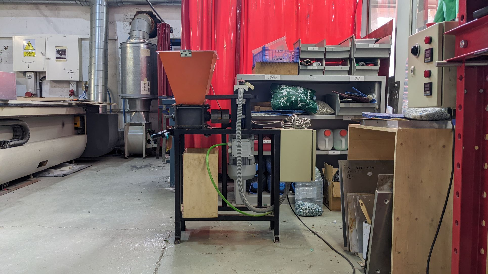
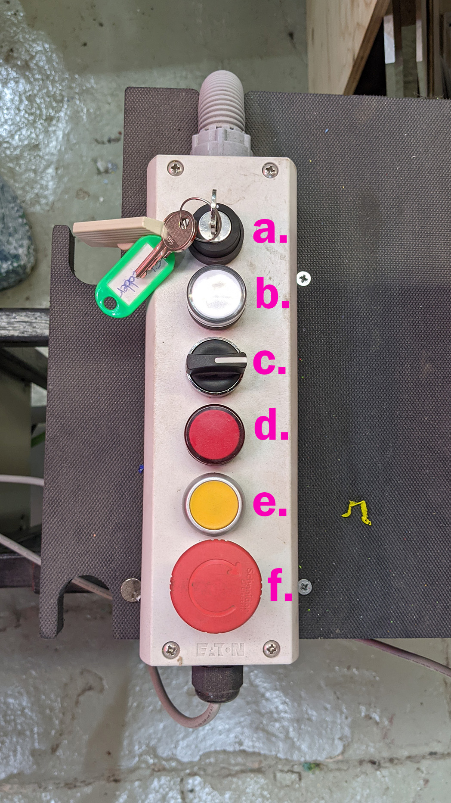

# Precious Plastic Shredder

## Technical specifications

- **Brand:** Fab Lab Barcelona (concept by Precious Plastic)  
- **Work area:** Laser cutting room
- **Materials:** Plastics, wood, fabrics, other
- **Technology:** Shredding, grinding
- **Machine parts:** ///MACHINE PARTS DIAGRAM///

## Applications

**Primary application is the shredding of materials**
Application is determined by the thickeness of material vs the strength of the motor. This machine is experimental in its use and there are no hard or fast rules dictating the application. Simply put, start with small amounts of material and proceed with mechanical sympathy to avoid overloading the motor.

## Health & Safety

**Familiarise yourself with the location of the emergancy off button**

**Danger from entanglement** - The blades of the shredder can be exposed from above and below. Be sure to fit the mesh to the underside of the machine and make sure that these areas are clear of clothing, body parts and amything else that could get caught in them. 

**Danger from material ejection** - Depending on the material the shredding process can be quite violent with material be ejected above and below the shredder. Be sure to keep the lid closed on the shredder.

**Danger from sharp blades** - Be careful of the blades when cleaning material from the blades. Where possible use a tool rather than your hands.

**Danger from circumventing safety protocols** - There are protocols in place to help prevent the above dangers. Do not attempt to circumvent these in the operation of the machine.

## Operation

a. main power key switch
b. power and operation indicator light (yellow when powered, green when operating) 
c. direction switch
d. warning/error indicator light
e. reset button
f. emergancy power off mushroom button

1. Check condition of machine and that there is no left material from previous use
2. Fit the mesh protector with the 4 bolts below the shredder
3. Place the collector box under the shredder
4. Gather the sorted material you want to shred
5. Plug in and turn on the machine with the key switch **(a.)**
6. Place small amounts of material in the hoper.
7. Close the lid
8. Turn the motor on in the forward direction by turning the direction switch **(c.)** clockwise
9. Continue to shred until all material is processed
10. Turn off the machine with the direction switch and key switch
11. Store the shredded material
12. Clean the machine

## Maintenance

Under normal operation the main mainenace required is cleaning out any material after use. This should be done by the user as part of the use of the machine. 

## Useful information

 - Fit the mesh to the underside of the machine. This can be tricky but is a nessacery step. 
 - It is possible to run the machine backwards to clear material with the direction switch. This is a manual operation and works for the duration of the switch being held in the direction.
 - The machine will automatically cut off when the motor is overloaded and the red light will illuminate to notify the operator of an issue. 
 - The lid of the shredder has an electronic cutoff that prevents that motor from working while the lid is open. 

### External resources

  - [Suppliers](https://community.preciousplastic.com/academy/build/shredder)
  - [User Manual](link to manual)
  - [Info page](https://community.preciousplastic.com/academy/build/shredder)

## Troubleshooting

- Blades don’t grab the plastic - Run the machine backward to jostle the material, anti-clockwise on the direction switch **(c.)** // Reposition the material in the shredder by hand when the machine is off.  
- THe Blades stop turnning mid operation - Is the red light **(d.)** illuminated? This indicates the motor is overloaded. Switch off machine and remove material or run the machine backwards.
- Machine will not turn on // blades do not turn - Check that the emergancy stop mushroom button **(f.)** is not applied. // Check that the lid is correctly closed so that the magnetic safety cut-off is connected. 
